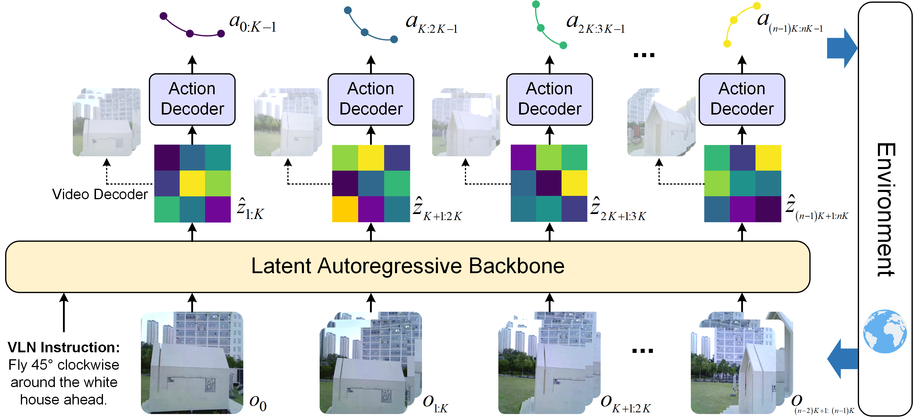

# WorldVLN: Autoregressive World Action Model for Aerial Vision-Language Navigation


This is the official code repository for WorldVLN. The repository includes the main code paths used for backbone training, action decoding, inference serving, and post-training workflows.

## Overview

The current codebase is organized into three major components:

| Directory | Description |
| --- | --- |
| [Train_WAM/](./Train_WAM) | Training package for backbone finetuning and the latent-to-action **action decoder** (training, batch inference, evaluation). |
| [infer/](./infer) | Online inference service for serving the model as an API. |
| [posttrain/](./posttrain) | Post-training workflows: **rollout** collection and **train** (optimization), including simulator-backed rollout support. |

At a high level, `Train_WAM/` covers model training and offline prediction utilities, `infer/` covers deployment-oriented inference, and `posttrain/` covers the later-stage optimization pipeline.

## Installation

We recommend using a single Python 3.10 environment for the released workflows. In our validated launch scripts, the Python interpreter is passed explicitly through `PYTHON_BIN`, so after activating your environment it is recommended to export:

```bash
export PYTHON_BIN=$(which python)
```

### Recommended Environment

1. Create a Python 3.10 environment.

```bash
conda create -n worldvln python=3.10
conda activate worldvln
```

2. Install a PyTorch build that matches your CUDA environment. For the released training and post-training workflows, a PyTorch 2.5.1 environment is the recommended baseline.

3. Install the shared dependencies used by the released workflows.

```bash
pip install -r requirements.txt
```

## Setup

### Model Weights

Official WorldVLN backbone weights are available on Hugging Face:

- [WorldVLN backbone weights](https://huggingface.co/anonymous-WorldVLN/WorldVLN/tree/main/WorldVLN_backbone)

Download the weights to your preferred checkpoint directory and configure the relevant training or inference scripts to point to them.

### Additional Assets

Depending on the workflow, you may also need additional runtime assets that are not shipped in this repository.

| Asset | Typical Variable or Path | Used By |
| --- | --- | --- |
| InfinityStar checkpoint | `INFINITY_CKPT` | `infer/`, `posttrain/` |
| Shared T5 and VAE assets | `CHECKPOINTS_DIR` | `posttrain/` and local inference flows |
| Action-head checkpoint | `ACTIONHEAD_CKPT` | `infer/`, `posttrain/` |
| Action-head config | `ACTIONHEAD_RUN_CONFIG` | `infer/`, `posttrain/` |
| Rollout manifest JSON | `SRC_JSON` | `posttrain` rollout |
| UAV-Flow task JSON root | `UAVFLOW_TASK_JSON_ROOT` | `posttrain` remote simulator rollout |
| Replay metadata | `REPLAY_META_DIR` | `posttrain` train |

Notes:

- The repository does not ship private checkpoints or dataset payloads; supply them through environment variables or explicit arguments.
- Do not commit local runtime artifacts (caches, logs, checkpoints) back into the repository.

## Inference

The repository currently provides two main inference surfaces.



### Online Inference Service

The online service lives under [infer/](./infer) and is intended for deployment-oriented usage.

- Entry points: [infer/run_server.sh](./infer/run_server.sh), [infer/infinity_tsformer_api_server.py](./infer/infinity_tsformer_api_server.py)
- Configuration: [infer/config.json](./infer/config.json)
- Typical usage: serve the model behind an HTTP API for online prediction or system integration

At a high level, this service consumes the current observation context and model inputs, then returns action predictions through the API server.

#### Quick start

From the repository root:

```bash
export PYTHON_BIN=$(which python)
export INFINITY_CKPT=/path/to/infinity/global_step_xxx.pth
export STAGE2_LATENT2ACTION_CKPT=/path/to/stage2_latent2action_combined.pt

bash infer/run_server.sh
```

Common environment variables:

- `INFINITY_CKPT`: main InfinityStar / WorldVLN checkpoint used by the service
- `STAGE2_LATENT2ACTION_CKPT`: Stage-2 latent-to-action checkpoint for action prediction
- `INFINITY_SERVER_CONFIG`: optional override for `infer/config.json`
- `INFINITY_REPO_ROOT`: optional override for the bundled `infer/InfinityStar-main/`
- `INFINITY_LATENT_CACHE_ROOT`: runtime cache directory used by the service
- `HOST`, `PORT`: bind address for Uvicorn

### Batch Latent-to-Action Inference

This path is intended for **offline** inference and evaluation on route-level data (as opposed to online serving).

The batch inference entrypoints live under `Train_WAM/action_decoder/`:

- Inference: [Train_WAM/action_decoder/tools/predict_pose.py](./Train_WAM/action_decoder/tools/predict_pose.py)
- Evaluation: [Train_WAM/action_decoder/tools/eval_endpoints.py](./Train_WAM/action_decoder/tools/eval_endpoints.py)

#### 1) Prepare route folders

Each route directory under `--data_root` should contain:

```text
<route>/
  latents.pt
  preprocessed_logs.json
```

`preprocessed_logs.json` is a list of poses with layout `[x, y, z, roll, yaw, pitch]` (angles are treated as degrees by default).

#### 2) Run batch inference

From the repository root:

```bash
python Train_WAM/action_decoder/tools/predict_pose.py \
  --ckpt <path/to/stage2_checkpoint>.pth \
  --data_root <route_root_dir> \
  --out_dir <output_root_dir> \
  --infinitystar_root <path/to/InfinityStar-main> \
  --infinitystar_vae_path <path/to/infinitystar_videovae.pth>
```

Outputs are written per-route under `--out_dir/<route>/` and include `pred_actions.json` and `pred_path.json` for downstream evaluation or integration.

#### 3) Evaluate endpoints (optional)

```bash
python Train_WAM/action_decoder/tools/eval_endpoints.py \
  --gt_root <gt_route_root_dir> \
  --pred_root <output_root_dir> \
  --out_root <eval_out_dir>
```

## Training

Training code is provided for multiple stages of the WorldVLN stack.


### Backbone Training

The backbone finetuning workflow is located under [Train_WAM/](./Train_WAM).

- Entry point: [Train_WAM/scripts/train_from_base.sh](./Train_WAM/scripts/train_from_base.sh)
- Main trainer: [Train_WAM/train.py](./Train_WAM/train.py)
- Detailed guide: [Train_WAM/TRAINING.md](./Train_WAM/TRAINING.md)

Use this workflow when you want to fine-tune the WorldVLN backbone from base checkpoints.

#### Quick start

```bash
bash Train_WAM/scripts/train_from_base.sh
```

### Action Decoder Training

The action decoder workflow is located under [Train_WAM/action_decoder/](./Train_WAM/action_decoder) and is organized into two stages.

- Stage 1 adapter distillation: [Train_WAM/action_decoder/scripts/train_stage1_ddp.sh](./Train_WAM/action_decoder/scripts/train_stage1_ddp.sh)
- Stage 2 latent-to-action training: [Train_WAM/action_decoder/scripts/train_stage2_ddp.sh](./Train_WAM/action_decoder/scripts/train_stage2_ddp.sh)
- Main scripts: [Train_WAM/action_decoder/tools/train_stage1_ddp.py](./Train_WAM/action_decoder/tools/train_stage1_ddp.py), [Train_WAM/action_decoder/tools/train_stage2_ddp.py](./Train_WAM/action_decoder/tools/train_stage2_ddp.py)

This workflow trains the mapping from visual latent features to 6-DoF motion outputs.

Data contract (training manifest):

```json
{
  "items_train": [
    {
      "latent_path": "path/to/latents.pt",
      "traj_json_path": "path/to/preprocessed_logs.json",
      "images_dir": "path/to/images"
    }
  ]
}
```

Stage 1 required environment variables:

- `MANIFEST_JSON`
- `TSFORMER_CKPT`
- `INF_VAE_PATH`

Run Stage 1:

```bash
bash Train_WAM/action_decoder/scripts/train_stage1_ddp.sh
```

Stage 2 required environment variables:

- `MANIFEST_JSON`
- `TSFORMER_PRETRAINED`
- `ADAPTER_CKPT`
- `INFINITYSTAR_VAE_PATH`

Run Stage 2:

```bash
bash Train_WAM/action_decoder/scripts/train_stage2_ddp.sh
```

### Post-Training

The post-training workflow is located under [posttrain/](./posttrain) and is organized into two steps: **rollout** and **train**.

- Rollout collection: [posttrain/scripts/run_stagea_collect.sh](./posttrain/scripts/run_stagea_collect.sh)
- Train (partial-freeze optimization): [posttrain/scripts/run_stageb_partialfreeze.sh](./posttrain/scripts/run_stageb_partialfreeze.sh)
- Remote simulator service wrapper: [posttrain/scripts/run_remote_sim_service.sh](./posttrain/scripts/run_remote_sim_service.sh)
- Local inference launcher used by rollout: [posttrain/run_infer_server.sh](./posttrain/run_infer_server.sh)

At a high level:

- Rollout consumes rollout sources and model assets, then generates rollout caches and replay metadata.
- Train consumes replay metadata and runs post-training to produce updated checkpoints and logs.

#### Quick start (rollout + train)

Start the local inference service used by rollout:

```bash
INFINITY_CKPT=/path/to/infinity/global_step_xxx.pth \
CHECKPOINTS_DIR=/path/to/checkpointsinf \
ACTIONHEAD_CKPT=/path/to/actionhead/checkpoint_last.pth \
ACTIONHEAD_RUN_CONFIG=/path/to/actionhead/run_config.json \
bash posttrain/run_infer_server.sh
```

Run rollout collection:

```bash
SRC_JSON=/path/to/reference_video_full_49f_trajectory_prompts.json \
INFINITY_CKPT=/path/to/infinity/global_step_xxx.pth \
CHECKPOINTS_DIR=/path/to/checkpointsinf \
ACTIONHEAD_CKPT=/path/to/actionhead/checkpoint_last.pth \
ACTIONHEAD_RUN_CONFIG=/path/to/actionhead/run_config.json \
UAVFLOW_STAGEA_ROLLOUT_BACKEND=remote_sim \
UAVFLOW_SIMULATOR_BASE_URL=http://127.0.0.1:18765 \
UAVFLOW_TASK_JSON_ROOT=/path/to/UAV-Flow-Eval/test_jsons \
bash posttrain/scripts/run_stagea_collect.sh RUN_ID=remote_sim_smoke TOP_N=1 K_CAND=1 STAGEA_NPROC=1
```

Run train (partial-freeze optimization):

```bash
CHECKPOINTS_DIR=/path/to/checkpointsinf \
RUSH_RESUME=/path/to/infinity/global_step_xxx.pth \
REPLAY_META_DIR=/path/to/replay_meta_rollout_smoke \
bash posttrain/scripts/run_stageb_partialfreeze.sh PARTIAL_FREEZE_MODE=smoke RUN_ID=stageb_smoke
```

For simulator-backed rollout details, see [posttrain/docs/remote_sim.md](./posttrain/docs/remote_sim.md).

## License

This project is released under the MIT License. See `LICENSE`.